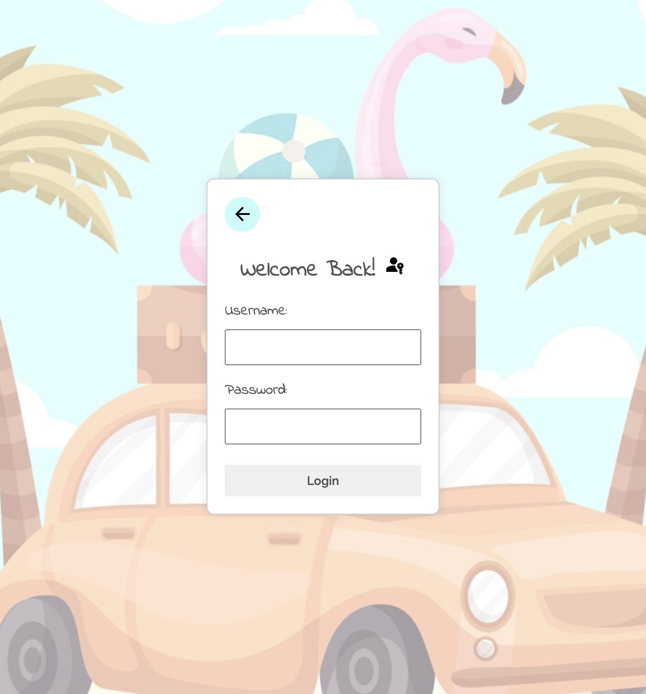

# Project Title
**WePool**

## Overview

WePool is a versatile web app designed to connect people traveling in the same direction for various purposes, including work, school, trips, and more. It facilitates ride-sharing and assists users in finding others with similar travel routes, helping them save on transportation costs and reduce commute times, all while promoting eco-friendly transportation solutions.

### Problem

WePool addresses the pain points associated with commuting and traveling in general. These pain points may include high fuel costs, traffic congestion, limited parking availability, and the need for cost-effective, convenient, and sustainable transportation options. By offering a platform for sharing rides and optimizing the use of public transportation, WePool aims to make travel more efficient and affordable for a wide range of purposes.

### User Profile

WePool's user base will be diverse and could include individuals traveling for work, school, leisure, or any other purpose. Users can sign up, input their travel routes and schedules, and search for others with similar itineraries. Special considerations for the app would involve ensuring user privacy, safety, and convenience, as mentioned previously, while accommodating a variety of trip types and preferences. The app should offer features to help users coordinate and share rides for a wide range of travel purposes.

### Features

1. **User Registration and Profiles**
        - Users can create accounts with their personal information.
        - Users can set their travel preferences, including their regular commuting routes and preferred travel times.

2. **Trip Creation and Search**
        - Users can create a new trip listing, specifying the starting point, destination, and time of travel.
        - Users can search for available trips based on their travel criteria

3. **Ride Matching**
        - The app should provide a matching algorithm that suggests potential ride matches based on user criteria, including travel route and time

## Implementation

### Tech Stack

1. **Frontend:** React for building a responsive and interactive web application.

2. **Backend:** Node.js with Express for a fast and scalable server-side application.

3. **Database:** MySQL for efficient and relational data storage, managing user profiles, trips, and related information.

4. **Authentication:** JWT (JSON Web Tokens) for secure user authentication, ensuring data integrity and confidentiality.

5. **Styling:** Sass for maintainable and structured styles.

### Sitemap

1. **Home:** Overview of the app's purpose and features.

2. **Profile:** User details, preferences, and trips.

3. **Create Trip:** Form for entering trip details.

4. **Search Trips:** Interface for finding matching trips.

5. **Matched Trips:** Displays confirmed matches.

### Mockups

  
  
  
  
  
  

### Data

- **Users:** Storing user information

- **Trips:** Details about created trips, including start, end, and return times.

### Endpoints

1. **Register a New User**
        - Endpoint: POST `/users/register`
        - Parameters: `username` (string), `email` (string), `password` (string), `full name` (string), `phone number` (string), and `mini bio` (string)
        - Example Response: {"Signed Up! Go to Login"}

2. **Login Existing User**
        - Endpoint: POST `/users/login`
        - Parameters: `username` (string), `password` (string)
        - Example Response: Redirects user to their profile.

3. **User's Profile When Logged In**
        - Endpoint: GET `/users/current`
        - Retrieves information for the currently logged-in user.

4. **Edit Profile for Currently Logged In User**
        - Endpoint: PUT `/users/:id`
        - Parameters: `username` (string), `email` (string), `password` (string), `phone number` (string) and `mini bio` (string)

5. **Delete Profile for Currently Logged In User**
        - Endpoint: DELETE `/users/:id`
        - Users can delete their profiles if they no longer wish to use the app.

6. **Trips Available**
        - Endpoint: GET `/trips`
        - Retrieves all available/posted trips from the database.
        - Can be filtered to provide matching trips based on user input.
        
7. **Initiate the Ride-Matching Process**
        - Endpoint: POST `/trips`
        - Parameters: `start` and `end` locations, `departure` and `return` times, `user_id` - currently logged in user 
        - Example Response: {'Ride posted successfully!'}

8. **Deleting Trip**
        - Endpoint: DELETE `/trips/:id`
        - Users can delete trips they no longer want to offer.

### Auth

- WePool will implement JWT token-based authentication to ensure secure user access and protect user data.

## Roadmap

**Sprint Plan (14 Days)**
        
- Days 1-2 (11/15 - 11/16): Project Setup and UI
    - Set up the project structure and version control (GitHub)
    -  Initialize the React project.
    - Create basic UI components for the home and user registration screens.
    - Begin styling with Sass.

- Days 3-4 (11/17 - 11/18): User Registration and Authentication
    - Implement user registration functionality (POST /users/register).
    - Integrate JWT authentication for secure user access.
    - Create UI components for user registration and authentication.
    - Implement basic error handling for registration.
        
- Days 5-7 (11/19 - 11/21): Trip Functionality
    - Implement trip creation functionality (POST /trips).
    - Develop UI components for creating and searching trips.
    - Implement basic trip matching logic (POST /trips).
    - Create trip cards and trip listing components.

- Days 8-10 (11/22 - 11/24): Refinement and Testing
    - Complete trip matching logic and refine algorithms.
    - Refine UI elements and address any issues identified during testing.

- Days 11-12 (11/25 - 11/26): Finalization
    - Finalize UI designs for all screens.
    - Conduct additional testing and debugging.
    - Implement any remaining features or improvements.
    - Prepare the project for deployment.

- Days 13-14 (11/27 - 11/28): Deployment
    - Deploy the application to a testing environment.
    - Address any deployment issues and ensure a smooth deployment.

## Nice-to-have

1. **In-App Messaging**

    - Implement a real-time messaging system for users to communicate seamlessly within the app.

2. **Reviews and Ratings**

    - Integrate a reviews and ratings system for users to leave feedback after completing a trip.
    - Build trust and reputation within the WePool community, providing valuable insights for future users.

3. **Notification System**

    - Implement a robust notification system to keep users informed about trip matches, messages, and other relevant updates.

